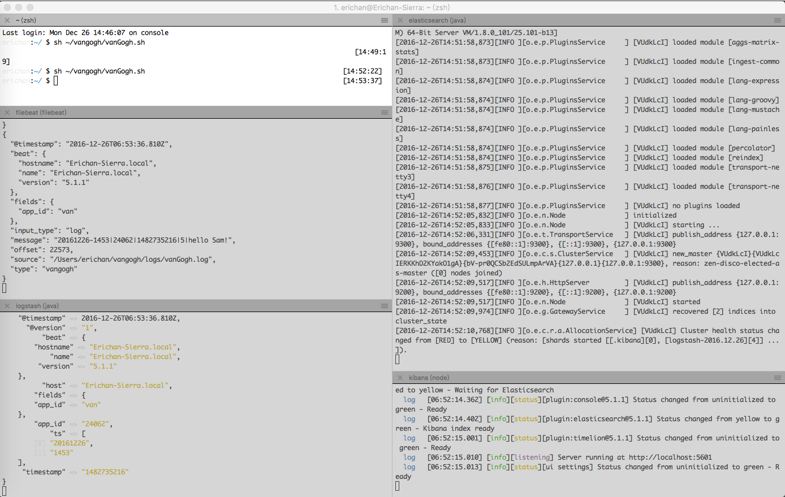
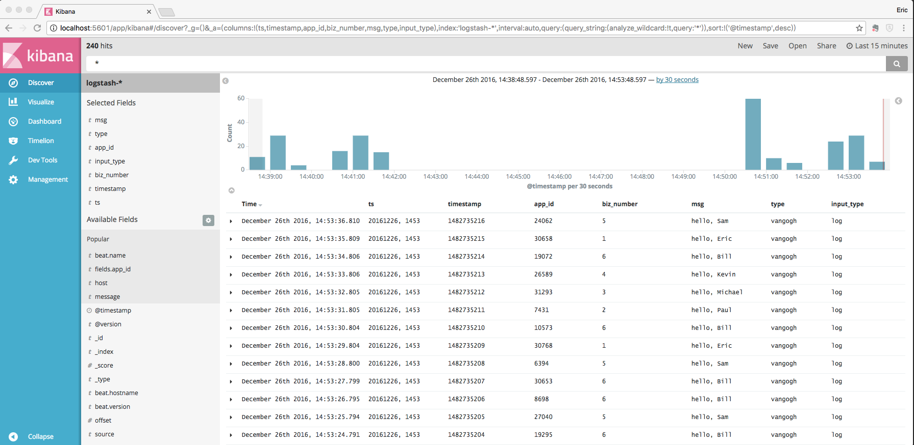

## running elastic stack with brew on  macOS

### 1 filebeat

#### 1.1 install
```sh
brew install/list/upgrade filebeat
```

```sh
To have launchd start filebeat now and restart at login:
  brew services start filebeat
Or, if you don't want/need a background service you can just run:
  filebeat
```

#### 1.2 random log script

1.copy vanGogh.sh to ~/vangogh/

```sh
#!/bin/sh
#
# vanGogh script.
# 2016.12.21
#

scriptPath=$(cd $(dirname $0);pwd)
cd $scriptPath
mkdir logs  2>/dev/null && touch vanGogh.log

messages=("Vincent" "Eric" "Paul" "Michael" "Kevin" "Sam" "Bill")
i=1
while [ ${i} -le 60 ]
do
  vanId=$RANDOM
  timestamp=$(date +%s)
  time=$(date +%Y%m%d-%H%M)
  n=$((RANDOM % ${#messages[@]} ))
  echo "${time}|${vanId}|${timestamp}|$n|hello ${messages[$n]}!" >>logs/vanGogh.log
  sleep 1s 
  ((i++))
done
```

2.start vanGogh.sh

```sh
sh ~/vangogh/vanGogh.sh
```

3.log located: ~/vangogh/logs/vanGogh.log

```
20161226-1419|13231|1482733189|5|hello Sam!
20161226-1419|23527|1482733190|0|hello Vincent!
20161226-1419|15542|1482733191|4|hello Kevin!
...
```

#### 1.3 filebeat config

> ~/vangogh/vanGogh.fb.yml

```yml
filebeat:
  prospectors:
    - input_type: log
      paths:
        - /Users/erichan/vangogh/logs/vanGogh.log
      exclude_lines: ['^DBG']
      fields:
        app_id: van
      document_type: vangogh
output:
  logstash:
    hosts: ["localhost:5043"]
  console:
    pretty: true
```

#### 1.4 start
```sh
filebeat -c ~/vangogh/vanGogh.fb.yml
```

### 2 logstash
#### 2.1 install
```sh
brew install/list/upgrade logstash
```

#### 2.2 logstash config

> ~/vangogh/vanGogh.ls.conf

```ruby
input {
  beats {
    port => "5043"
  }
}

filter {
  grok {
    match => { 
      "message" => "%{WORD:ts}\-%{WORD:ts}\|%{WORD:app_id}\|%{NUMBER:timestamp}\|%{NUMBER:biz_number}\|%{WORD:msg}%{SPACE}%{WORD:msg}"
    }
  }
}

output {
  elasticsearch { hosts => ["localhost:9200"] }
  stdout { codec => rubydebug }
}
```
#### 2.3 test conf
```shell
logstash -f ~/vangogh/vanGogh.ls.conf --config.test_and_exit
```
#### 2.4 start
```sh
logstash -f ~/vangogh/vanGogh.ls.conf --config.reload.automatic
```

### 3 elasticsearch
#### 3.1 install
```sh
brew install/list/upgrade elasticsearch
```

```sh
Data:    /usr/local/var/elasticsearch/elasticsearch_erichan/
Logs:    /usr/local/var/log/elasticsearch/elasticsearch_erichan.log
Plugins: /usr/local/Cellar/elasticsearch/5.1.1/libexec/plugins/
Config:  /usr/local/etc/elasticsearch/
plugin script: /usr/local/Cellar/elasticsearch/5.1.1/libexec/bin/plugin

To have launchd start elasticsearch now and restart at login:
  brew services start elasticsearch
Or, if you don't want/need a background service you can just run:
  elasticsearch
```
#### 3.2 start
```sh
elasticsearch
```

### 4 kibana

#### 4.1 install
```sh
brew install/list/upgrade kibana
```

```sh
Config: /usr/local/etc/kibana/
If you wish to preserve your plugins upon upgrade, make a copy of
/usr/local/opt/kibana/plugins before upgrading, and copy it into the
new keg location after upgrading.

To have launchd start kibana now and restart at login:
  brew services start kibana
Or, if you don't want/need a background service you can just run:
  kibana
```

#### 4.2 start
```sh
kibana
```

### 5 screenshot
#### elastic stack console
- `sh ~/vangogh/vanGogh.sh`
- `filebeat -c ~/vangogh/vanGogh.fb.yml`
- `logstash -f ~/vangogh/vanGogh.ls.conf`
- `elasticsearch`
- `kibana`



#### kibana


### 6 References
1. [Elasticsearch for Hadoop](https://www.elastic.co/guide/en/elasticsearch/hadoop/current/index.html)
2. [Elasticsearch指南](https://www.elastic.co/guide/en/elasticsearch/guide/current/index.html)
3. [Elasticsearch文档](https://www.elastic.co/guide/en/elasticsearch/reference/current/index.html)
4. [filebeat](https://www.elastic.co/guide/en/beats/filebeat/current/index.html)
5. [logstash](https://www.elastic.co/guide/en/logstash/current/index.html)
6. [kibana](https://www.elastic.co/guide/en/kibana/current/index.html)